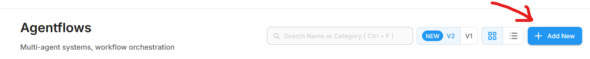
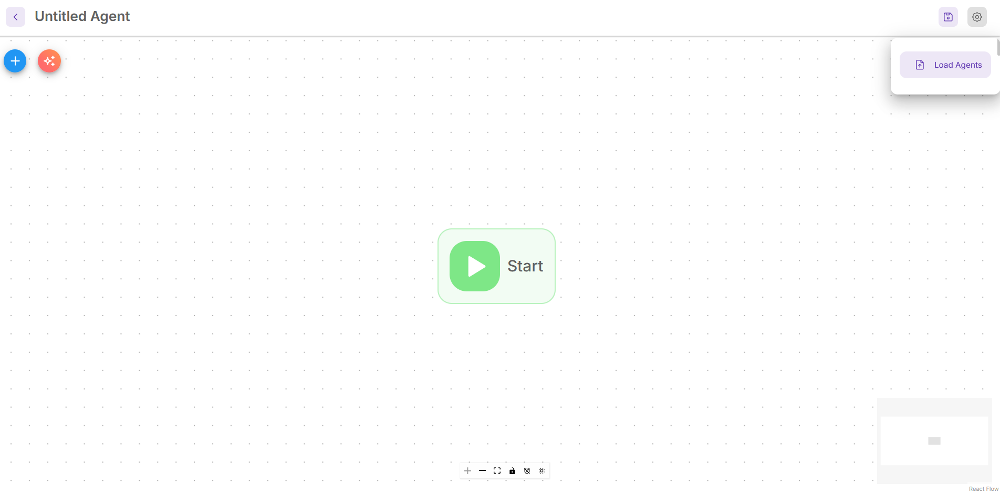
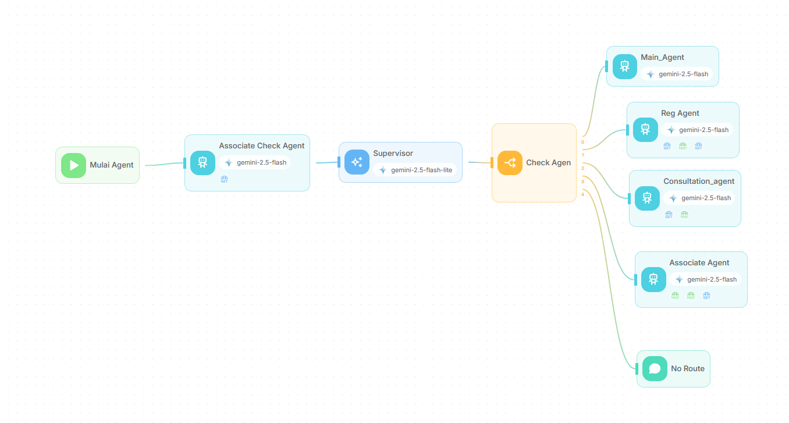

# ARUNA
ARUNA (Asisten Rujukan Nasional), asisten digital berbasis Agentic AI dan Generative AI yang membantu peserta BPJS memahami dan menjalankan alur rujukan pelayanan kesehatan secara tepat dan efisien. ARUNA menjelaskan penyakit dan kelayakan penjaminan BPJS berbasis literatur resmi dan RAG, memandu alur rujukan sesuai regulasi, menawarkan penjadwalan janji temu dokter berdasarkan lokasi dan ketersediaan, serta mendeteksi potensi fraud rujukan melalui analisis pola data. Sistem diintegrasikan dengan WhatsApp untuk interaksi real-time yang familiar bagi peserta, menggunakan Flowise AI untuk agentic logic, RAG dengan pinecone.io untuk akurasi, dan custom backend API untuk konektivitas layanan.


## Usage Guide :
### Requirement yang diperlukan:
Instalasi dari Flowise, WAHA, dan MySQL.
### 1. Flowise: <br>

Menggunakan Si BPJS.json import sebagai agent baru di agentflow v2.  
dengan langkah sebagai berikut :  


Kemudian import `SI BPJS.json` sebagai agent baru.

Tampilan pada Flowise akan menjadi seperti ini.
perlu disesuaikan alamat tool call yang digunakan oleh flowise dengan runtime yang digunakan.

### 2. Python Backend: <br>

untuk menjalankan python backend jalankan app.py melalui myenv dengan 
```
.\myenv\Scripts\activate
python app.py
```
Sebelumnya ubah settingan konfigurasi untuk menyesuaikan runtime yaitu DATABASE_URL, FLOWISE_PREDICTION_URL, WAHA_SEND_URL, dan WAHA_API_KEY.

Webhook WAHA perlu diarahkan ke endpoint dari python backend ini agar whatsapp bisa terhubungan dengan agentic ai di flowise.


